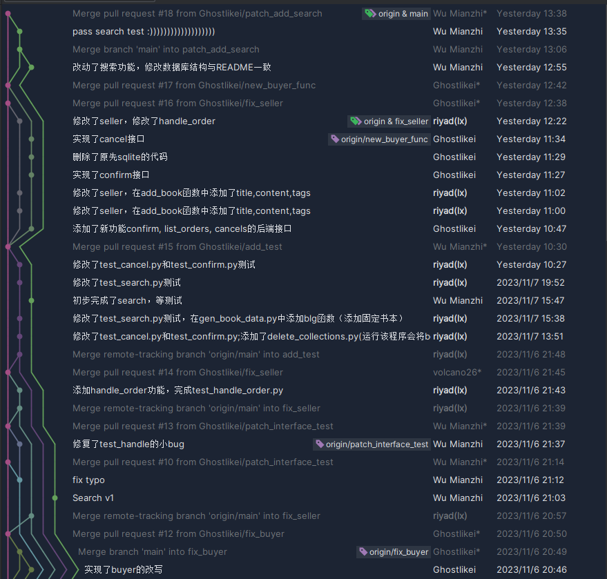
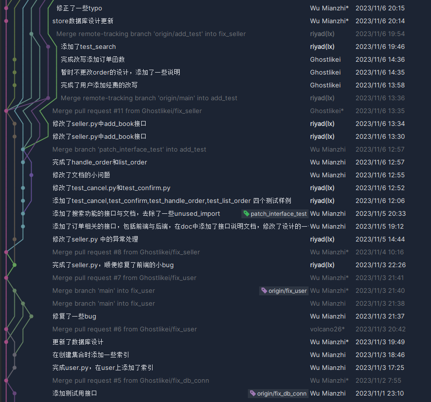
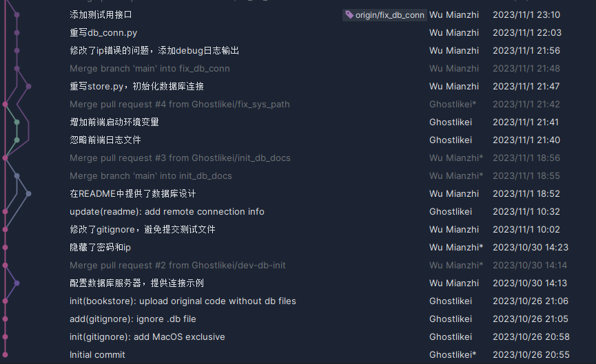

# Bookstore项目报告

## 小组成员及其分工：

## 1. 文件结构：

## 2. 数据库设计：

## 3.功能实现设计及测试

### 3.1  User：

#### 3.1.1 register：

- ##### be/model：

  

- ##### be/view：

  

- ##### be/access：

  

#### 3.1.2 check token：
- ##### be/model：

  

- ##### be/view：

  

- ##### be/access：

  

#### 3.1.3 check password:
- ##### be/model：

  

- ##### be/view：

  

- ##### be/access：

  

#### 3.1.4 login:
- ##### be/model：

  

- ##### be/view：

  

- ##### be/access：

  

#### 3.1.5 logout:
- ##### be/model：

  

- ##### be/view：

  

- ##### be/access：

  

#### 3.1.6 unregister:
- ##### be/model：

  

- ##### be/view：

  

- ##### be/access：

  

#### 3.1.7 change_password:
- ##### be/model：

  

- ##### be/view：

  

- ##### be/access：

  

### 3.2  Seller接口：

#### 3.2.1 add_book:

**传入：**书本信息	**作用：**将书本信息存入`["store"]`中

- ##### be/model：

  在数据库`be.store`中添加书本的内容（所有者id，商店id，书本id，库存数量，价格，标题，内容，标签）

  这里将原本插入所有的`book_info`去除，从中选取我们所需要的内容插入如价格，标题，内容，标签；而对于类似图片等存放所需空间很大对于我们用处不大的选择不插入。

- ##### be/view：

  修改了`book_info`的属性（为`dict`而不是`str`），而后使用`.get()`在`book_info`获取`(id,price,title,content,tags)`内容添加到`message`中

- ##### be/access：

  使用POST方法将`json`数据传入相对应的url

#### 3.2.2 add_stock_level:

**传入：** 用户id，商店id，书本id，增加库存数量	**作用：**对于相应的书本增加库存

- ##### be/model：

  使用`update_one`和`$inc`函数对于对应的`store_id`和`book_id`的`stock_level`都进行相对应的添加

- ##### be/view：

  

- ##### be/access：

  

#### 3.2.3 create_store:
- ##### be/model：

  

- ##### be/view：

  

  

- ##### be/access：

  

#### 3.2.4 handle_order:
- ##### be/model：

  

- ##### be/view：

  

- ##### be/access：

  

- ##### fe/test：

  

### 3.3  buyer接口：

#### 3.3.1 new_order:
- ##### be/model：

  

- ##### be/view：

  

- ##### be/access：

  

#### 3.3.2 payment:
- ##### be/model：

  

- ##### be/view：

  

- ##### be/access：

  

#### 3.3.3 add_funds:
- ##### be/model：

  

- ##### be/view：

  

- ##### be/access：

  

#### 3.3.4 confirm:
- ##### be/model：

  

- ##### be/view：

  

- ##### be/access：

  

- ##### fe/test：

  

#### 3.3.5 list_order:
- ##### be/model：

  

- ##### be/view：

  

- ##### be/access：

  

- ##### fe/test：

  

#### 3.3.6 cancel:
- ##### be/model：

  

- ##### be/view：

  

- ##### be/access：

  

- ##### fe/test：

  

## 4. 测试覆盖率以及通过情况

## 5.使用索引,程序与数据库执行的性能提升

## 6.使用 git 等版本管理工具

附上：github仓库https://github.com/Ghostlikei/CDMS_bookstore
