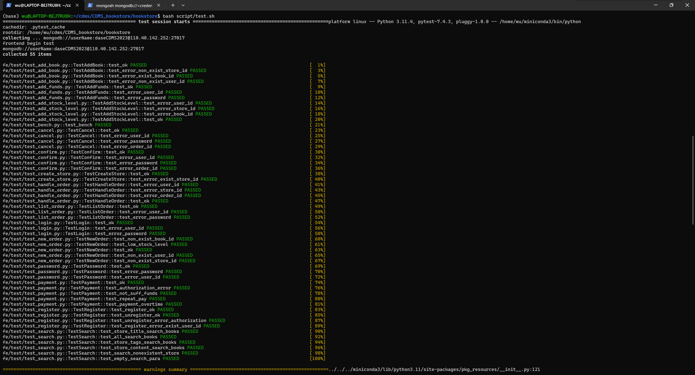
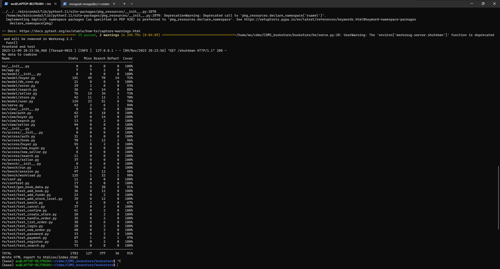

# Bookstore项目报告

## 小组成员及其分工：

10215501402 廖翔 ：前60%中的`seller`接口内容；后40%中`handle_order`函数实现，以及`cancel`,`confirm`,`search` 的`test`测试

10215501403 沈桐乐：前60%buyer接口的改写，参与数据库结构的设计，后40%订单查询，主动取消定单，超时订单自动取消，确认订单，修改buyer接口的测试用例

10215501411 吴冕志：前60%中user接口的改写与数据库基本操作的改写，设计了数据库结构，编写后40%中的搜索功能，编写list_order和handle_order的测试用例，编写了后40%中的前后端接口

## 1. 文件结构：

```bash
│  app.log
│  be.db
│  info.txt
│  requirements.txt
│  setup.py
│  
│              
├─be
│  │  app.py
│  │  serve.py
│  │  __init__.py
│  │  
│  ├─model
│  │  │  buyer.py
│  │  │  db_conn.py
│  │  │  error.py
│  │  │  search.py
│  │  │  seller.py
│  │  │  store.py
│  │  │  user.py
│  │  │  __init__.py  
│  │          
│  ├─view
│  │  │  auth.py
│  │  │  buyer.py
│  │  │  search.py
│  │  │  seller.py
│  │  │  __init__.py
│          
├─doc
│      auth.md
│      buyer.md
│      search.md
│      seller.md
│      
├─fe
│  │  conf.py
│  │  conftest.py
│  │  __init__.py
│  │  
│  ├─access
│  │  │  auth.py
│  │  │  book.py
│  │  │  buyer.py
│  │  │  new_buyer.py
│  │  │  new_seller.py
│  │  │  search.py
│  │  │  seller.py
│  │  │  __init__.py
│  │          
│  ├─bench
│  │  │  bench.md
│  │  │  run.py
│  │  │  session.py
│  │  │  workload.py
│  │  │  __init__.py
│  ├─data
│  │      book.db
│  │      scraper.py
│  │      
│  ├─test
│  │  │  delete_collections.py
│  │  │  gen_book_data.py
│  │  │  test.md
│  │  │  test_add_book.py
│  │  │  test_add_funds.py
│  │  │  test_add_stock_level.py
│  │  │  test_bench.py
│  │  │  test_cancel.py
│  │  │  test_confirm.py
│  │  │  test_create_store.py
│  │  │  test_handle_order.py
│  │  │  test_list_order.py
│  │  │  test_login.py
│  │  │  test_new_order.py
│  │  │  test_password.py
│  │  │  test_payment.py
│  │  │  test_register.py
│  │  │  test_search.py
│      
└─script
        test.sh
```

## 2. 数据库设计：

我们的MongoDB数据库部署在小组成员已有的腾讯云服务器上，这样各小组成员就不需要单独处理与数据库环境有关的问题，同时小组成员也可以在同一个数据库上进行工作，更好地进行开发，调试与测试任务。

程序本身所用到的文档都存放在`be`数据库下，包括以下几个collections：`user`, `store`, `order`, `order_detail`, `order_archive`，它们的具体结构与属性如下所示：

`user`集合用于存储系统的已注册用户的基本信息，同时还存储了用户与书店之间的关系

```
class User:
    _uid, # mongodb 默认建立
    uid, # uid上建立唯一索引
    password,
    balance,
    token,
    terminal,
    sid, # 用户拥有的store_id，如果用户仅仅作为买家注册，那么此项为空
```

`store`集合虽然看起来叫书店，但其实是用来表示书店和书的关系

```
class Store:
    _uid, # mongodb 默认建立
    # (sid, bid)上建立复合索引（唯一）
    sid, # store_id
    bid, # book_id
    stock_level,
    price, # 定价
    owner # 拥有者的用户uid
    # 以及书本的元数据，包括：
    title,
    tags,
    content,
    content_seg, # 建立全文索引
```

由于每个`sid`都是不同的，因此`store`中的每个文档代表书店`sid`中书`bid`的信息。与将书的`bid`存储在一个数组中的设计相比，这样的设计能够帮助我们避免对文档的某个数组属性进行更新操作，而只需要对一个文档进行简单的更新或新增操作即可，同时，(sid, bid)上的复合索引保证我们对于书店中书的信息的查找与更新都具有较高的效率。

为了更好地完成搜索功能，我们在`content`中存储书本的内容信息，由于MongoDB的社区版不支持中文分词查询，我们手动在插入文档时进行分词，并在分词后的`content_seg`属性上建立全文索引，提升搜索的效率。

采用类似的思想，我们将订单整体信息与订单中书的信息分别存储在`order`和`order_detail`集合中

```
class Order:
    _uid, 
    oid # 在此处oid=uid，uid由用户，商店和随机生成的字符串组成
    uid # 买家uid，建立索引
    sid # 书店id，建立索引
    state, # 订单状态：待付款(Pending)，待发货(ToShip)，待收货(Shipped)
    total_price, # 订单总价
class OrderDetail:
    # (oid, bid)建立复合索引
    oid,
    bid,
    count,
    price, # 单价
```

同时，为了方便操作，我们在`order`中存储订单的总价，避免再到`order_detail`中进行查询计算总价，减少不必要的数据库查询次数。

除了上面这些完成基本功能的集合外，我们还有一个特殊的集合`order_archive`用于存储已经完成的订单，它与`order`的结构一致

```
class OrderArchive:
    _uid, 
    oid # 和Order一致
    uid # 买家uid
    sid # 书店id，建立索引
    # 以及一些其它的信息，没想好
    state, # 订单状态：已收货(Received)，已取消(Cancelled)
    total_price, # 订单总价
```

将未完成的订单与已完成的订单分别存储的原因基于下面的事实：

- 随着时间和用户的增加，未完成的订单数远小于已完成的订单
- 在订单未完成时，我们会频繁地对订单进行CRUD操作，包括更改订单状态，删除订单等
- 对于用户而言，用户在订单未完成时查询订单的频率往往高于查询已完成的订单
- 对于订单的状态来说，订单超时取消，主动取消和已完成是最终状态，不会再更改订单的信息

因此，分开存储两种订单有助于我们缩小CRUD操作进行的文档集合的大小，提升操作效率。


## 3.功能实现设计及测试

### 3.1  User：

#### 3.1.1 register：(/auth/register)

**参数：** 用户id ， 密码 	**作用：**注册用户

- ##### be/model：

  使用`insert_one`将用户数据：用户id，密码，余额（初始为0），`token`，`terminal`插入`user`中

- ##### be/view：

  用于获取传入参数：用户id ， 密码

- ##### fe/access：

  使用POST方法将`json`数据传入相对应的url，返回状态码

#### 3.1.2 check password:

**参数：** 用户id ， 密码	**作用：** 检查密码

- ##### be/model：

  先对于用户id进行寻找后进行判断：若`password != user["password"]`则返回错误码

#### 3.1.3 login:(/auth/login)

**参数：** 用户id ，密码，`terminal`  **作用：** 用户登录

- ##### be/model：

  首先先使用`check_password`判断其用户密码是否正确

  使用`self.db["user"].update_one({'uid': user_id}, {'$set': {'token': token, 'terminal': terminal}})`将`token`设置为登录状态

  `matched_count == 0`判断其登入的完成状态

- ##### be/view：

  用于获取传入参数：用户id ， 密码 ， `terminal`

- ##### fe/access：

  使用POST方法将`json`数据传入相对应的url，返回状态码和对应的`token`

#### 3.1.4 logout:(/auth/logout)

**参数：** 用户id ， `token`  **作用：** 用户登出

- ##### be/model：

  使用`self.db["user"].update_one({'uid': user_id}, {'$set': {'token': dummy_token, 'terminal': terminal}})`将`token`设置为登出状态

  `matched_count == 0`判断其登出的完成状态

- ##### be/view：

  用于获取传入参数：用户id ， `token`

- ##### fe/access：

  使用POST方法将`json`数据传入相对应的url，返回状态码

#### 3.1.5 unregister:(/auth/unregister)

**参数：** 用户id ， 密码     **作用：**  删除已注册用户

- ##### be/model：

  首先先使用`check_password`判断其用户密码是否正确

  使用`self.db["user"].delete_one({'uid': user_id})`删除已存在的用户

  `deleted_count == 1`判断删除的完成状态

- ##### be/view：

  用于获取传入参数：用户id ， 密码 

- ##### be/access：

  使用POST方法将`json`数据传入相对应的url，返回状态码

#### 3.1.6 change_password:(/auth/password)

**参数：** 用户id ， 旧密码 ，新密码 	**作用：** 更改密码

- ##### be/model：

  首先先使用`check_password`判断其用户密码是否正确

  使用`self.db["user"].update_one({'uid': user_id}, {'$set': {'password': new_password, 'token': token, 'terminal': terminal}})`修改为新密码

  `modified_count != 1`判断更改密码的完成状态

- ##### be/view：

  用于获取传入参数：用户id ， 旧密码 ，新密码

### 3.2  Seller接口：

#### 3.2.1 add_book:(/seller/add_book)

**传入：**书本信息	**作用：**将书本信息存入`["store"]`中

- ##### be/model：

  在数据库`be.store`中添加书本的内容（所有者id，商店id，书本id，库存数量，价格，标题，内容，标签）

  ```python
   def add_book(
          self,
          user_id: str,
          store_id: str,
          book_id: str,
          book_info_str: str,
          stock_level: int,
          price: float,
          title: str,
          content: str,
          tags: str,
  ):
  ```

  这里将原本插入所有的`book_info`去除，从中选取我们所需要的内容插入如价格，标题，内容，标签；而对于类似图片等存放所需空间很大对于我们用处不大的选择不插入。

  

  并且使用`jieba`去对于`content`进行中文的分词

  ```python
   content_words = jieba.lcut_for_search(content)
              content_segmented = " ".join(content_words)
  ```

  

- ##### be/view：

  修改了`book_info`的属性（为`dict`而不是`str`），而后使用`.get()`在`book_info`获取`(id,price,title,content,tags)`内容添加到`message`中

- ##### fe/access：

  使用POST方法将`json`数据传入相对应的url，返回状态码

#### 3.2.2 add_stock_level:(/seller/add_stock_level)

**参数：** 用户id，商店id，书本id，增加库存数量	**作用：**对于相应的书本增加库存

- ##### be/model：

  使用`update_one`和`$inc`函数对于对应的`store_id`和`book_id`的`stock_level`进行相对应的添加

  ```python
  store_collection.update_one(
                  {"sid": store_id, "bid": book_id},
                  {"$inc": {"stock_level": add_stock_level}})
  ```

- ##### be/view：

  用于获取传入参数：用户id，商店id，书本id，增加库存数量（这个为`int`类型）

- ##### fe/access：

  使用POST方法将`json`数据传入相对应的url，返回状态码

#### 3.2.3 create_store:(/seller/create_store)

**参数：** 用户id，商店id 	**作用：** 对于`user`中添加用户和商店的关系

- ##### be/model：

  我们设计的`create_store`并不是对于`store`这个collection进行操作而是对于`user`将`sid`和其`uid`建立联系，表明其这个用户拥有这个商店

  使用`user_store_collection.update_one({"uid": user_id},{"$set":{"sid":store_id}})`建立联系

- ##### be/view：

  用于获取传入参数：用户id，商店id

- ##### fe/access：

  使用POST方法将`json`数据传入相对应的url，返回状态码

#### 3.2.4 handle_order:(/seller/handle_order)

**参数：** 用户id，商店id，订单id 	**作用：** 将相对应的`order_id`判断其订单状态并且商家确定订单并且发货

- ##### be/model：

  这里首先我们先定义了一个订单状态错误的error 521 `error_wrong_state`; 用于订单状态是否正确

  先搜索传入参数的`order_id`并且判断订单状态若订单状态正确，就使用`update_one`和`set`将其从待发货`ToShip`改为已发货`Shipped`，表明商家已经确认处理订单并且发货

  ```python
  order = order_collection.find_one({"oid": order_id})
              if order["state"] == desired_state:
                  update_result = order_collection.update_one(
                      {"oid": order_id},
                      {"$set": {"state": "Shipped"}})
  ```

  使用`modified_count > 0 `判断订单是否修改成功

- ##### be/view：

  用于获取传入的参数：用户id，商店id，订单id

- ##### fe/access：

  使用POST方法将`json`数据传入相对应的url，返回状态码

- ##### fe/test：

  **测试包含：** 1.测试错误用户id	2.测试错误商店id	3.测试错误订单id	4.测试函数实现
  
  **初始化：**随机定义买家身份信息以及卖家id，商店id，使用`GenBook.gen`构造书本信息并获取购入书本列表
  
  而后使用`new_order`函数对于订单进行构造
  
  使用`add_fund`函数给予买家足够的资金后使用`payment`进行付款使得订单状态变为`ToShip`进入测试

- ### 3.3  buyer接口：

  对于买方的前后端当中，主要实现了以下几个功能：

  - 已有的sqlite3到pymongo代码的改写，包括买方新增订单，买方支付和买方添加经费
  - 新增功能：
    - 买方确认收货
    - 买方取消订单，由于我们的数据库设计买方和卖方共用user，所以卖方取消订单的接口也在这里
    - 超时自动取消订单
    - 查询订单功能
    - 所有终止状态订单（已取消，已收货）从order当中剔除，放入orderArchive当中

  #### 3.3.1 new_order:

  `/buyer/new_order`

  **输入**：用户id，商店id，[(书本id，书本数量)]

  **返回**：状态码，信息，订单号

  - ##### be/model：

  在当前的数据库设计下，首先检查商店的书本存量，用户id和商店id的合法性

  由用户，商店和随机生成的字符串组成一个**订单id**

  对于每一本书的订单请求，查询书本存量是否足够，

  当每一本书的订单请求存量足够后，减去库存，计算总金额，对于每一本书的订单信息，作为一个列表一起存入`order_details`当中

  ```py
  order_details.append({
      "oid": order_id,
      "bid": book_id,
      "count": count,
      "price": price,
  })
  ```

  之后**获得当前下单时间**，把前面全部信息存入`order`当中，设置当前状态为**待付款（Pending）**

  ```py
  self.db.order.insert_one({
      "oid": order_id,
      "uid": user_id,
      "sid": store_id,
      "state": "Pending",
      "total_price": total_price,
      "time": datetime.now()
  })
  ```

  - ##### be/view：

  （此部分没有变动）

  获得前端传入后端的参数：用户id，商店id，书本列表(id, count)，生成buyer对象传入`be/model/buyer`的new_order接口当中

  返回后端信息，订单id，状态码

  - ##### fe/access：

  （此部分没有变动）

  传入用户id，商店id，书本列表，等后端相应之后，返回状态码和订单id

  - **fe/test**
    - 测试书本id不存在的情况
    - 测试库存不够的情况
    - 测试正常下单的情况
    - 测试用户id不存在的情况
    - 测试商店id不存在的情况

  对于这一部分来说，主要实现的功能是检查订单是否合法，以及设置状态为待付款，因此测试主要关注合法性，对于订单状态的测试主要在后文中涉及

  #### 3.3.2 payment:

  `/buyer/payment`

  **输入**：用户id，用户密码，订单id

  **输出**：状态码，后端信息

  - ##### be/model：

  在当前数据库的设计下，首先做合法性检查，检查订单是否存在，用户是否存在，密码是否正确

  检查账户余额和当前订单的金额是否足够

  **检查当前订单是否超时**，如果超时则取消订单，把订单放入orderArchive当中，设置状态为**已取消（Cancelled）**

  （对于订单超时的补充说明：超时订单只会在下单未支付的时候才会发生，因此我们采用**懒设计**，只有查询订单状态，以及支付订单的时候对于下单时间一项进行处理）

  通过检查之后，设置订单状态为**待发货(ToShip)**，扣除对应的用户余额

  - ##### be/view：

  （此部分没有变动）

  后端接受前端参数，返回后端的返回值

  - ##### fe/access：

  （此部分没有改动）

  前端发送参数给后端，获得后端的状态码和信息

  - **fe/test**
    - 测试正常支付的情况
    - 测试用户不存在/密码错误的情况
    - 测试账户余额不够的情况
    - 测试重复支付的情况
    - 测试支付超时订单的情况

  这一部分的测试除了常规检查之外，主要是考虑支付异常的情况，包含重复支付，余额不足，订单超时三种情况

  支付完毕之后的状态交给商家处理

  #### 3.3.3 add_funds:

  `/buyer/add_funds`

  **输入**：用户id，密码，增加金额

  **输出**：状态码，后端信息

  - ##### be/model：

  检查用户id和密码的合法性，通过测试后在user的balance一项加上经费

  - ##### be/view：

  （此部分没有变动）

  后端接受前端参数，返回后端的返回值

  - ##### fe/access：

  （此部分没有改动）

  前端发送参数给后端，获得后端的状态码和信息

  - **fe/access**：
    - 测试正常情况
    - 测试用户id不存在/密码错误情况

  #### 3.3.4 confirm:

  `/buyer/confirm`

  **输入**：用户id，密码，订单号

  **输出**：状态码，后端信息

  - ##### be/model：

  检查用户id/密码的合法性

  **检查订单状态，必须是已发货（Shipped）**

  通过检查之后，设置订单状态为**已收货（Received）**，将当前订单从`order`当中删除，放入`order_archive`当中

  - ##### be/view：

  参考其他后端的实现，后端接受前端参数，返回后端的返回值

  - ##### fe/access：

  参考其他前端的实现，前端发送参数给后端，获得后端的状态码和信息

  - ##### fe/test：

    - 测试正常情况
    - 测试用户id不存在/密码错误情况
    - 测试订单id错误/状态错误情况

  #### 3.3.5 list_orders:

  `/buyer/list_orders`

  **输入**：用户id，密码

  **输出**：状态码，后端信息，**订单列表**

  - ##### be/model：

  首先检查用户id是否存在/密码是否正确

  在`order`当中的uid索引上，检索所有uid相同的订单，

  考虑之前懒设计的说明，如果检查订单已超时，则设置订单状态为**已取消（Cancelled）**，放入`order_archive`当中

  对于其他的订单，获得订单信息并且添加在列表中

  ```py
  for order in orders:
      # Check for TLE
      if 'time' in order and current_time - order['time'] > timedelta(seconds=tle):
          self.archiveOrder(order['oid'], "Cancelled")  # Archive the order
          continue  # Do not add TLE orders to the result
      output = {
          "oid": order["oid"],
          "uid": order["uid"],
          "sid": order["sid"],
          "state": order["state"],
          "total_price": order["total_price"],
          "time": order["time"],
      }
      result.append(output)
  ```

  之后在索引uid上查询`order_archive`当中所有uid相同的订单，加入结果列表中

  - ##### be/view：

  参考其他后端的实现，后端接受前端参数，返回后端的返回值

  后端的返回值中，订单列表的信息放在json的message后边，作为一个包含字典的列表返回给前端

  - ##### fe/access：

  参考其他前端的实现，前端发送参数给后端，获得后端的状态码和信息，以及解析后的订单结果

  - ##### fe/test：

    - 测试了用户id/密码不合法的情况
    - 测试了正常查询订单的情况，每一个订单号应该和手动加入的订单号相同

  #### 3.3.6 cancel:

  `/buyer/cancel`

  **输入**：用户id，密码，订单号

  **输出**：状态码，后端信息

  - ##### be/model：

  检查用户id/密码的合法性

  通过检查之后，设置订单状态为**已取消（Cancelled）**，将当前订单从`order`当中删除，放入`order_archive`当中

  - ##### be/view：

  参考其他后端的实现，后端接受前端参数，返回后端的返回值

  - ##### fe/access：

  参考其他前端的实现，前端发送参数给后端，获得后端的状态码和信息

  - ##### fe/test：

    - 测试正常情况
    - 测试用户id不存在/密码错误情况
    - 测试订单id错误的情况

### 3.4 Search:

url： `/search`

**参数：** 搜索参数（本店/全站搜索，标题关键字，标签关键字，内容关键字），每页返回的搜索结果数，返回搜索结果的页号	**作用：** 根据搜索关键字在`store`数据库中搜索对应的书籍信息，返回指定页的搜索结果

- ##### be/model：

  从参数构造对应的MongoDB查询语句，对于不同的搜索参数，我们有不同的查询方式

  - `sid`：控制全站或在指定商店搜索，要求严格等于
  - `title`：标题关键字，使用正则表达式匹配包含关键字的文档
  - `tags`：标签数组，查询书本标签中至少包含查询标签中的一个标签的文档
  - `content`：内容关键字，在分词后的`content_seg`上使用`$text`进行全文搜索。

  如果包含多个搜索关键字，我们的搜索返回多个搜索条件**均**满足的书本信息。

- ##### be/view：

  处理前后端通信，从前端POST请求中构建参数调用`model`中的对应方法，从调用结果来构建响应内容并回传

- ##### fe/access：

  前端模块，构建POST请求传递给后端，获取后端响应

- ##### fe/test：

  测试模块，执行下面几项测试：

  - 测试全站搜索
  - 测试指定商店的搜索
  - 测试对于标题/标签/内容的搜索
  - 测试能否对于不存在商店给出正确响应
  - 测试能否对于空搜索参数给出正确响应

### 3.5  错误代码（`error.py`）

| 错误码 | 错误原因     |
| ------ | ------------ |
| 401    | 授权失败     |
| 511    | 无效用户id   |
| 512    | 已存在用户id |
| 513    | 无效商店id   |
| 514    | 已存在商店id |
| 515    | 无效书本id   |
| 516    | 已存在书本id |
| 517    | 库存不够     |
| 518    | 无效订单id   |
| 519    | 用户余额不足 |
| 520    | 无效搜索参数 |
| 521    | 订单状态错误 |
| 522    | 订单处理超时 |

## 4. 测试覆盖率以及通过情况

测试用例全部通过



测试覆盖率高达91%



## 5.使用索引,程序与数据库执行的性能提升

在数据库设计一节中，我们提到了各集合的索引设计，为了讨论我们使用的索引对性能的影响，我们考察项目中所有的数据库查询，删除与更新操作，逐一评判索引对过滤集合的作用

### 5.1 user

- `user/check_token`：基于uid的查询，uid上有唯一索引，索引能够优化执行效率
- `user/check_password`：基于uid的查询，uid上有唯一索引，索引能够优化执行效率

- `user/login`：基于uid的查询与更新，uid上有唯一索引，索引能够优化执行效率
- `user/logout`：基于uid的查询与更新，uid上有唯一索引，索引能够优化执行效率
- `user/unregister`：基于uid的删除，uid上有唯一索引，索引能够优化执行效率
- `user/change_password`：基于uid的查询与更新，uid上有唯一索引，索引能够优化执行效率

### 5.2 seller

- `seller/add_stock_level`：基于(sid, bid)的更新，(sid, bid)上有复合唯一索引，索引能够优化执行效率
- `seller/create_store`：基于uid的更新，uid上有唯一索引，索引能够优化执行效率（该函数是在user collection上进行的更新）
- `seller/handle_order`：基于oid的更新，oid上有复合唯一索引，索引能够优化执行效率（该函数是在order collection上进行的更新）

### 5.3 buyer

- `buyer/new_order`：`store`上基于`(sid, bid)`的查询，基于`_id`的更新，(sid, bid)上有复合唯一索引，_id是默认主键，索引能够优化执行效率
- `buyer/payment`：
  - `store`上基于`sid`的查询与更新，(sid, bid)上有复合唯一索引
  - `user`上基于`uid`的查询与更新，uid上有唯一索引
  - `order`与`order_archive`上基于`oid`的查询与更新，oid上有唯一索引
- `buyer/add_funds`：`user`上基于`uid`的查询与更新，索引能够优化执行效率
- `buyer/confirm`：`user`上基于`uid`的查询，`order`上基于`oid`的删除
- `buyer/cancel`：`user`上基于`uid`的查询，`order`上基于`oid`的更新与删除
- `buyer/list_order`：`user`上基于`uid`的查询，`order`与`order_archive`基于`uid`的查询，两者都有`uid`上的索引，能够优化执行效率

### 5.4 search

- `/search`：基于`sid`的查询，基于`content_seg`的全文查询，(sid, bid)上有复合唯一索引，`content_seg`上有全文索引，索引能够优化执行效率

综合上面的讨论，我们可以发现我们的数据库操作都能够通过索引进行优化，达到较好的执行效率。

## 6.使用 git 等版本管理工具

我们的工作流借用github远端仓库实现三人同步，主要工作方式如下：

- 对于要实现的每一种功能，首先编写前后端接口，编写测试用例，通过接口测试，最后实现代码通过全部测试用例，符合标准模块开发流程

- 每个人的修改代码在**主分支**或者**子分支**上建立**新分支**，不影响原先分支，

  实现功能完成后提交pr，**不能由自己审查**，另外一人或两人**审查通过**之后，**通过全部测试用例**，即可合并到原先分支

- 每个人的修改文件和其他人修改文件**尽可能相同**，这样分工明确，而且能够有效减小分支conflict的发生

- 实现了单个函数/单个接口/单个测试之后，即刻commit一次，这样每一个开发节点都是可追溯的

在这样的版本控制和工作流下，我们达成了基本没有冲突的三人异步开发，而且多人审查机制有效防止了代码的不合理性

最终的代码版本，主分支一共合并了20条pr，总共commit数量达到了90以上


附上：github仓库https://github.com/Ghostlikei/CDMS_bookstore
